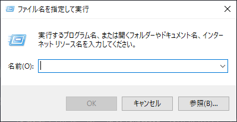
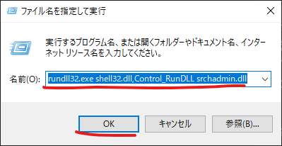
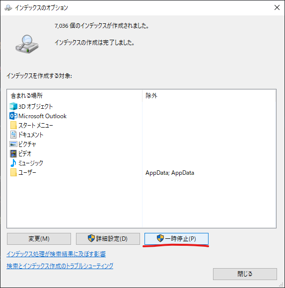
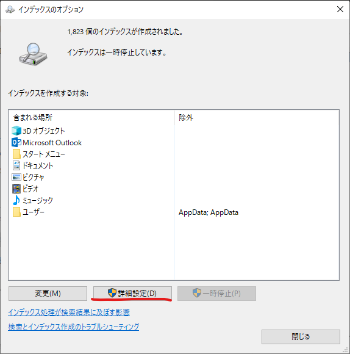
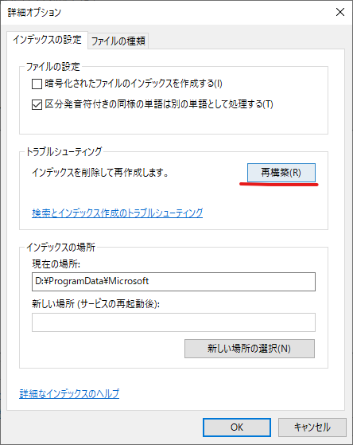
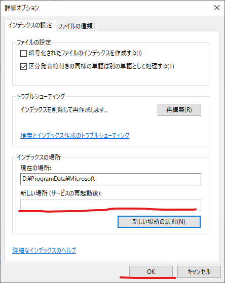
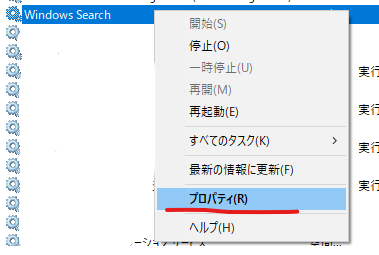

> [!NOTE]
> **お急ぎの方へ**  
> 最終的にインデックスの再構築で解決しました。詳細は [# インデックスの再構築](#インデックスの再構築) へ

Windows 10でパソコンのファイル整理をしていたところ、急に Windows.edb のサイズが増え続けるようになり、ついに C ドライブの残り容量が0バイトになるという自体に陥りました。  
発生から解決、そして原因の考察を記事にまとめておきます。記事内の画像は撮影した時系列のバラバラな箇所があります。

# 問題の発生

症状としては Windows.edb のサイズが数十 MB（ドライブの書き込み速度による？）で常時増え続けるというものです。

最初は Windows.edb のサイズ増加に気づかず、ファイル整理を進めていたところ整理したはずの C ドライブの容量が急激に減っていったところで気づきました。  
この増加量はすさまじく数秒に100 MB 程度増え続け、C ドライブを埋め尽くすまであっという間でした。

増加の様子 ※微点滅注意


気づいた頃にはだいぶ遅く、C ドライブの容量が0バイトになってからの対処になりました。  
システムがここでクラッシュしなかったのは幸いでした。


残容量0バイトはなかなか衝撃的な光景です。

# 解決

## インデックスのデフラグ（失敗）

[Microsoft の公式サイト](https://learn.microsoft.com/ja-jp/troubleshoot/windows-client/shell-experience/larger-windowsdotedb-file) でもこの問題について載っており、回避策として [デフラグの方法](https://learn.microsoft.com/ja-jp/troubleshoot/windows-client/shell-experience/larger-windowsdotedb-file#workaround) が記載されていたのでまずはそれを行おうとしました。

```cmd
Sc config wsearch start=disabled
Net stop wsearch

EsentUtl.exe /d %AllUsersProfile%\Microsoft\Search\Data\Applications\Windows\Windows.edb

Sc config wsearch start=delayed-auto

Net start wsearch
```

しかし、EsentUtl.exe を実行している途中にディスクの容量不足で止まってしまい失敗しました。  
ちなみにこの方法では数 GB 程度しか変わらず、あまり効果はないそうです。

## インデックスの再構築

最終的にはこの方法で解決しました。増加自体は止められず根本的解決にならない場合がありますが容量をあけることが可能です。

### やり方

#### インデックス設定を開く

再構築はインデックス設定から行います。  
まず `Windows + R` で `ファイル名を指定して実行` を開きます。



名前のところに以下のテキストを入力して OK を押します。

```
rundll32.exe shell32.dll,Control_RunDLL srchadmin.dll
```



参考：https://www.haruru29.net/blog/windows-search-index-file/

これでインデックスの設定画面が開きます。  
ディスクの容量不足が深刻な場合は `一時停止` を押してください。



次に、`詳細設定` を押します。



#### 再構築

詳細オプションが開いたら `再構築` を押します。



これによりインデックスが削除され、再構築が始まります。

# 再発防止

増加自体は止められましたが、このままではシステムに影響が出かねないので対策します。

## インデックスの場所を変更

症状について検索してみると以前から Windows.edb が極端に大きくなるというバグがあるようで、今後も起きる可能性とシステムドライブの容量を埋めるという重篤性から D ドライブにインデックスの位置を変更しました。

### やり方

解決の段落の [#### インデックス設定を開く](#インデックス設定を開く) でインデックスの設定画面を開きます。  

詳細オプションが開いたら `インデックスの場所` の `新しい場所` にシステムの入っていないドライブの場所を入力して OK を押します。  

※画像は C ドライブから変えた後


システムが動作に必要な読み書きするための容量を食われるのが問題なので、物理ディスクが1つでパーティションで C:と D:に分けている場合でも効果があります。

## インデックスの無効化

そもそも自分は普段ファイルの検索に Everything を使っており、システムでのファイル検索は必要なさそうだったので無効化することにしました。インデックスはファイルの検索以外にも使われるようですが、最低限の動作には必要ではないのといつでも有効化できるので無効化しても問題はなさそうです。  
ただし無効化すると Outlook のメール検索ができなくなるという情報もあったので Outlook を使ってる人は注意です。

### やり方

まずサービスアプリを起動します。


次にサービスの一覧から `Windows Search` を探します。環境によって名前が違う場合もあります。


項目を右クリックしてメニューからプロパティをクリックします。



プロパティ画面が開いたら `スタートアップの種類` を `無効` に設定します。  
次に、サービスの状態が `実行中` の場合は停止を押してサービスを止めます。

これでサービスを無効化できました。

# 原因の考察

Windows.edb に以前から存在する原因不明なバグで根本的な原因は不明ということになりますが、このバグが起きた理由にはいくつか心当たりがあります。

## 外付けSSD

普段は使わない重めなファイルを移すために USB 経由で外付けの SSD をつなぎました。
大容量のディスクをつなぐと認識されるファイルが一気に増えるので、これがインデックスの増加を引き起こした可能性は十分に考えられます。とはいってもインデックスだけで何十 GB も使うのはやはり異常ですが。

## ファイルの移動

問題が起きたのは先述した、ファイルの移動で内蔵のドライブと外付け SSD 間で50 GB の移動をしている最中でした。大量のファイルを移動したわけではなく25個程度の大きいファイルだったのですが、ファイルのアクセスにもインデックスを使用することもあるのでこれも原因の1つの可能性があります。

## デフォルト以外のライブラリ

インデックスの対象にはデフォルトでライブラリの場所が指定されていますが、ファイル整理の際に誤って適当なフォルダをライブラリに追加していて、それもインデックスの対象になっていました。  
これでインデックスが壊れるかはわかりませんが、時期を考えると原因の可能性があります。

# 最後に

容量不足にならないようにと整理をしたつもりが、システムドライブの残容量0という怖い思いをしました。

システムドライブの容量不足はシステム全体のクラッシュや起動エラーと言った重大な症状を引き起こす可能性が高いです。
ストレージセンサーを設定して残容量を監視するなど、システムドライブの容量には注意しましょう。

# 参考

- https://learn.microsoft.com/ja-jp/troubleshoot/windows-client/shell-experience/larger-windowsdotedb-file
- https://www.haruru29.net/blog/windows-search-index-file/
